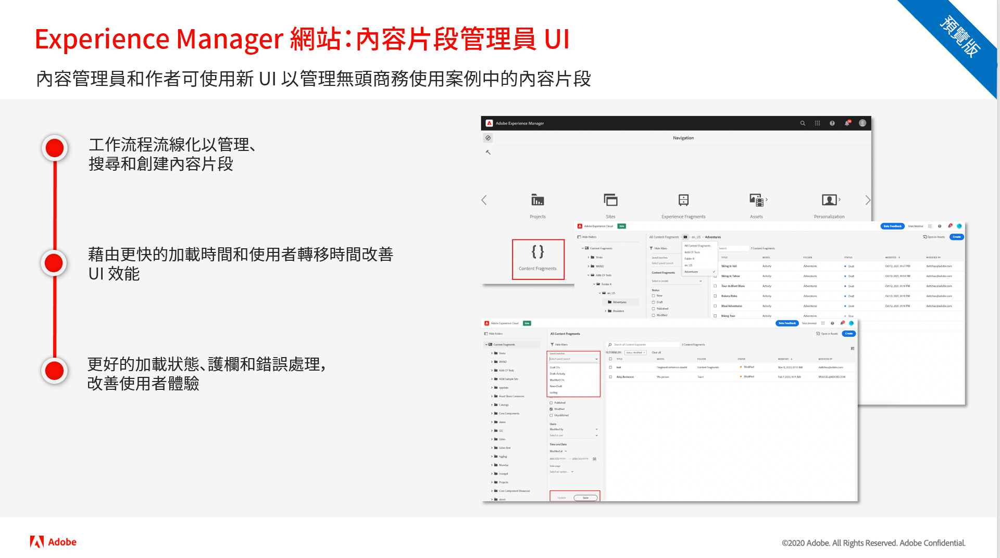

# Adobe Experience Manager as a Cloud Service 版本更新

取得 Adobe Experience Manager as a Cloud Service 最新功能快速總覽。這些是 AEM 產品團隊提供的簡短影片；每段影片大約 10 分鐘，主要是分享最新版本的摘要。

## 上次更新

<!---

<table style="max-width: 50%;">
  <tr>
    <td>
      
      

        <a href="./2023/2023-1-0.md">
          <strong>Release | 2023.1.0</strong>
           
        </a>
          <em>Release date  Feb 2023 </em>
      

      

        <a href="https://experienceleague.adobe.com/docs/experience-manager-cloud-service/content/release-notes/release-notes/release-notes-current.html">Release notes</a>
      

    </td>
  </tr>  
</table> 

## Past Updates

<table style="max-width: 50%;">
  <tr>
    <td>
      
      

        <a href="./2022/2022-10-0.md">
          <strong>Release | 2022.10.0</strong>
           
        </a>
          <em>Release date  Oct 13, 2022 </em>
      

      

        <a href="https://experienceleague.adobe.com/docs/experience-manager-cloud-service/content/release-notes/release-notes/release-notes-current.html">Release notes</a>
      

    </td>  
    <td>
      
      

        <a href="./2022/2022-8-0.md">
          <strong>Release | 2022.8.0</strong>
           
        </a>
          <em>Release date  Sept 1, 2022 </em>
      

      

        <a href="https://experienceleague.adobe.com/docs/experience-manager-cloud-service/content/release-notes/release-notes/release-notes-current.html">Release notes</a>
      

    </td>
    <td>
      
      

        <a href="./2022/2022-7-0.md">
          <strong>Release | 2022.7.0</strong>
           
        </a>
          <em>Release date  Aug 8, 2022 </em>
      

      

        <a href="https://experienceleague.adobe.com/docs/experience-manager-cloud-service/content/release-notes/release-notes/release-notes-current.html">Release notes</a>
      

    </td>
  </tr>
  <tr> 
    <td>
      
      

        <a href="./2022/2022-6-0.md">
          <strong>Release | 2022.6.0</strong>
           
        </a>
          <em>Release date  June 30, 2022 </em>
      

      

        <a href="https://experienceleague.adobe.com/docs/experience-manager-cloud-service/content/release-notes/release-notes/release-notes-current.html">Release notes</a>
      

    </td>
    <td>
      
      

        <a href="./2022/2022-5-0.md">
          <strong>Release | 2022.5.0</strong>
           
        </a>
          <em>Release date  June 9, 2022 </em>
      

      

        <a href="https://experienceleague.adobe.com/docs/experience-manager-cloud-service/content/release-notes/release-notes/release-notes-current.html">Release notes</a>
      

    </td>
    <td>
      
      

        <a href="./2022/2022-4-0.md">
          <strong>Release | 2022.4.0</strong>
           
        </a>
          <em>Released  May 5, 2022 </em>
      

      

        <a href="https://experienceleague.adobe.com/docs/experience-manager-cloud-service/content/release-notes/release-notes/release-notes-current.html">Release notes</a>
      

    </td>
  </tr>
  <tr> 
    <td>
      
      

        <a href="./2022/2022-3-0.md">
          <strong>Release | 2022.3.0</strong>
           
        </a>
          <em>Released  March 31, 2022 </em>
      

      

        <a href="https://experienceleague.adobe.com/docs/experience-manager-cloud-service/content/release-notes/release-notes/release-notes-current.html">Release notes</a>
      

    </td>
    <td>
      
      

        <a href="./2022/2022-1-0.md">
          <strong>Release | 2022.1.0</strong>
           
        </a>
          <em>Released  February 3, 2022 </em>
      

      

        <a href="https://experienceleague.adobe.com/docs/experience-manager-cloud-service/content/release-notes/release-notes/2022/release-notes-2022-1-0.html">Release notes</a>
      

    </td>
    <td>
      
      

      <a href="./2021/2021-11-0.md">
          <strong>Release | 2021.11.0</strong>
           
        </a>
      <em>Released  December 16, 2021</em>
      

      

        <a href="https://experienceleague.adobe.com/docs/experience-manager-cloud-service/content/release-notes/release-notes/2021/release-notes-2021-11-0.html">Release notes</a>
      

    </td>
  </tr>
</table>

--->

<table style="max-width: 50%;">
  <tr>
    <td>
      
      

        <a href="./2022/2022-10-0.md">
          <strong>版本 | 2022.10.0</strong>
           
        </a>
          <em>發行日期：2022 年 10 月 13 日</em>
      

      

        <a href="https://experienceleague.adobe.com/docs/experience-manager-cloud-service/content/release-notes/release-notes/release-notes-current.html">發行說明</a>
      

    </td>
  </tr>  
</table>

## 以前的更新

<table style="max-width: 50%;">
  <tr>
    <td>
      
      

        <a href="./2022/2022-8-0.md">
          <strong>版本 | 2022.8.0</strong>
           
        </a>
          <em>發行日期：2022 年 9 月 1 日</em>
      

      

        <a href="https://experienceleague.adobe.com/docs/experience-manager-cloud-service/content/release-notes/release-notes/release-notes-current.html">發行說明</a>
      

    </td>
    <td>
      
      

        <a href="./2022/2022-7-0.md">
          <strong>版本 | 2022.7.0</strong>
           
        </a>
          <em>發行日期：2022 年 8 月 8 日</em>
      

      

        <a href="https://experienceleague.adobe.com/docs/experience-manager-cloud-service/content/release-notes/release-notes/release-notes-current.html">發行說明</a>
      

    </td>
    <td>
      
      

        <a href="./2022/2022-6-0.md">
        <strong>版本 | 2022.6.0</strong>
         
      </a>
        <em>發行日期：2022 年 6 月 30 日</em>
      

      

        <a href="https://experienceleague.adobe.com/docs/experience-manager-cloud-service/content/release-notes/release-notes/release-notes-current.html">發行說明</a>
      

    </td>
  </tr>
  <tr>  
    <td>
      
      

        <a href="./2022/2022-5-0.md">
        <strong>版本 | 2022.5.0</strong>
         
      </a>
        <em>發行日期：2022 年 6 月 9 日</em>
      

      

        <a href="https://experienceleague.adobe.com/docs/experience-manager-cloud-service/content/release-notes/release-notes/release-notes-current.html">發行說明</a>
      

    </td>
    <td>
      
      

        <a href="./2022/2022-4-0.md">
        <strong>版本 | 2022.4.0</strong>
         
      </a>
        <em>發行日期：2022 年 5 月 5 日</em>
      

      

        <a href="https://experienceleague.adobe.com/docs/experience-manager-cloud-service/content/release-notes/release-notes/release-notes-current.html">發行說明</a>
      

    </td>
    <td>
      
      

        <a href="./2022/2022-3-0.md">
        <strong>版本 | 2022.3.0</strong>
         
      </a>
        <em>2022 年 3 月 31 日發佈</em>
      

      

        <a href="https://experienceleague.adobe.com/docs/experience-manager-cloud-service/content/release-notes/release-notes/release-notes-current.html">發行說明</a>
      

    </td>
  </tr>
  <tr>     
    <td>
      
      

        <a href="./2022/2022-1-0.md">
        <strong>版本 | 2022.1.0</strong>
         
      </a>
        <em>2022 年 2 月 3 日發佈</em>
      

      

        <a href="https://experienceleague.adobe.com/docs/experience-manager-cloud-service/content/release-notes/release-notes/2022/release-notes-2022-1-0.html">發行說明</a>
      

    </td>
    <td>
      
      

      <a href="./2021/2021-11-0.md">
          <strong>版本 | 2021.11.0</strong>
         
      </a>
    <em>2021 年 12 月 16 日發佈</em>
      

      

        <a href="https://experienceleague.adobe.com/docs/experience-manager-cloud-service/content/release-notes/release-notes/2021/release-notes-2021-11-0.html">發行說明</a>
      

    </td>
  </tr>
</table>
